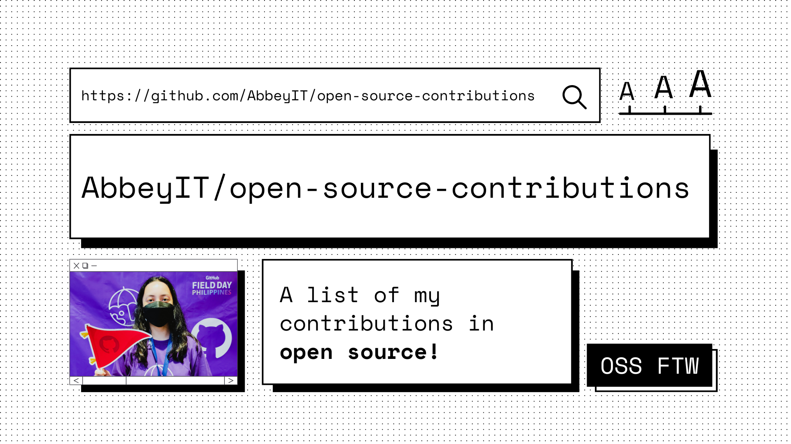

## Table of Contents

- [Documentation](#documentation)
- [Guides](#guides)
- [Resources](#resources)
- [Beginner Contributions](#beginner-contributions)
- [Low-code/Non-code](#low-codenon-code)
- [Issues](#issues)

## Documentation
- [Fix a file location](https://github.com/collab-community/journey-book/pull/129) - I fixed all the file location in Collab Community Journey Book's documentations 
- [Added License](https://github.com/Rutuj-Runwal/easynotes/pull/9) - The repository included license in the README.md. However, there's still no license added yet in the repository itself.
- [Fixed Grammatical Error](https://github.com/s-shemmee/Python-in-30-Days/pull/5) - This PR consists of fixing grammatical errors in their documentation.
- [Improve the content of documentation](https://github.com/TheBaljitSingh/portfolio/pull/2) - I added more sections and details for the person's project. I added more sections and details for the person's project. Although I expect they will continue to improve their documentation.

## Guides
- [How to add social preview](https://github.com/Pradumnasaraf/open-source-with-pradumna/blob/main/pages/How-to/guide/social-preview.md) - I created a guide on how to add a social preview to your GitHub repository.

## Resources 

## Beginner Contributions
- [First Pull Request](https://github.com/EddieHubCommunity/hacktoberfest-practice/pull/1272) - I had my first pull request with EddieHubCommunity's hacktoberfest-practice where I put my GitHub account on the documentation.
- [LinkFree](https://github.com/EddieHubCommunity/LinkFree/pull/1468#issue-1299626140) - I added my profile on linkfree, alternative for LinkTree. Check out [here](https://linkfree.eddiehub.io/AbbeyIT).
- [Fitness-Accountability](https://github.com/FitDevs-withKat/Fitness-Accountability/pull/181) - Joined the FitDevs and shared my goals in health.
- [First Contributions](https://github.com/firstcontributions/first-contributions/pull/51382) - I added my names as one of the contributors

## Low-code/Non-code
- [Journey](https://github.com/collab-community/journey-book/pull/133) - I shared my jouney in tech 
- [How HTTPS work](https://github.com/codemistic/Non-Code/pull/75) - I wrote a short blog about how HTTPs works 
- [Importing WorkInProgress](https://github.com/AccessibleForAll/AccessibleWebDev/pull/125) - This PR adds the WorkInProgress component into the ImagesTemplate
- [Magikarp Pokemon Card](https://github.com/dsasaank-369/Pokemon/pull/66) - This PR adds Magikarp in the pokemon characters.

## Issues
